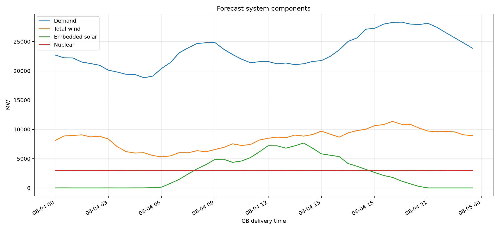
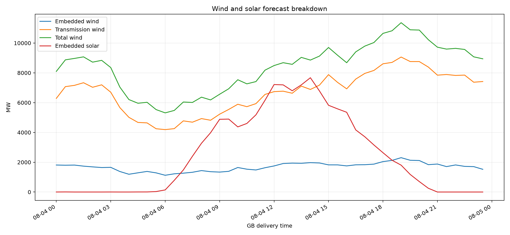
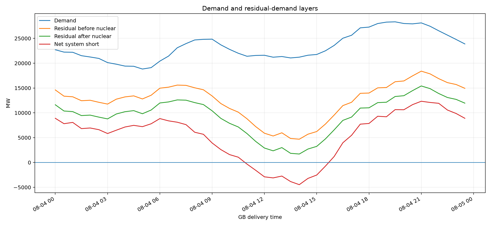
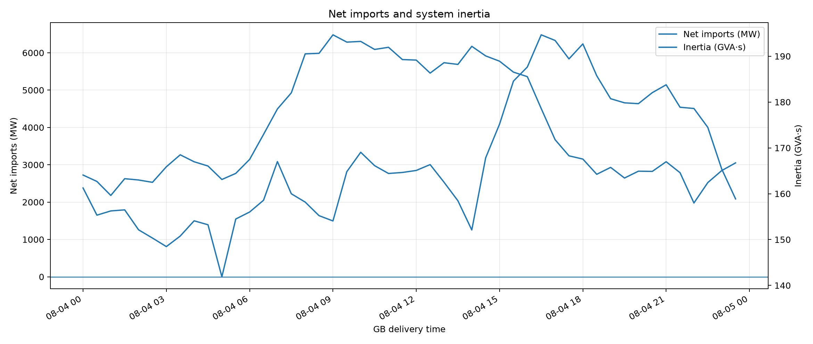
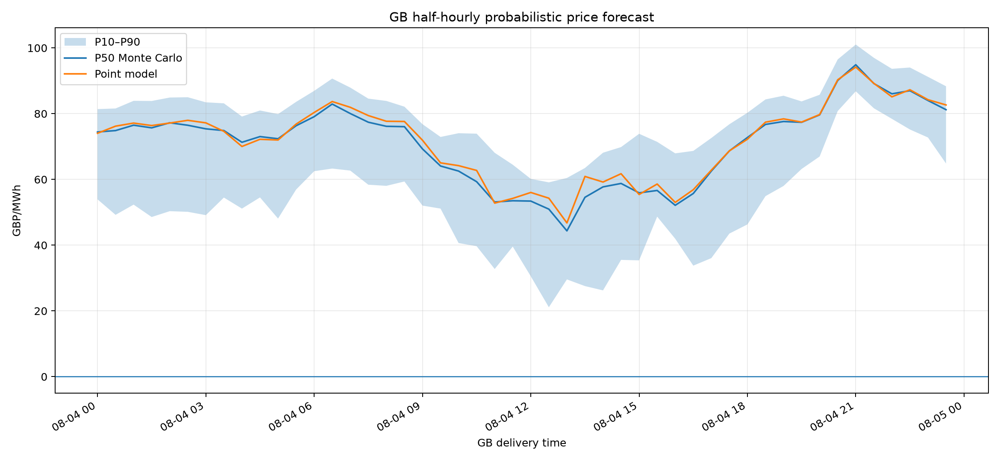
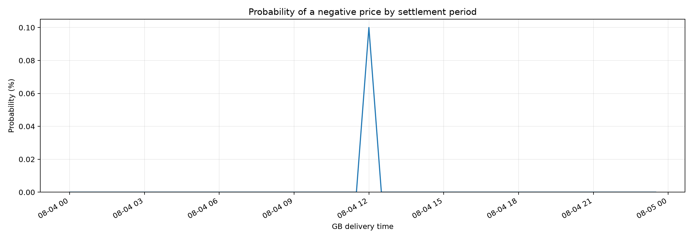
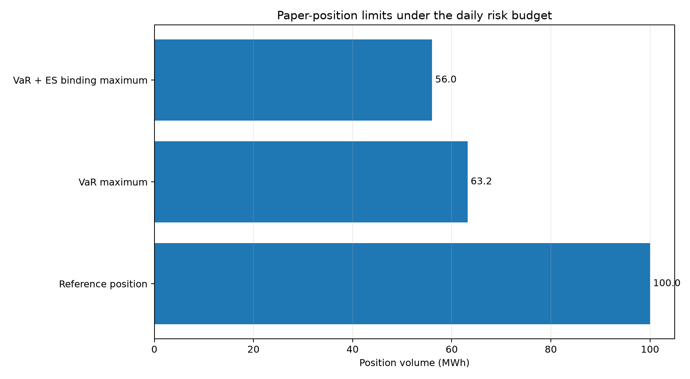

# GB day-ahead market report — 2026-08-04

**Model:** `core-12m-operational-v1`  
**Profile:** `core_without_battery`  
**Issue time:** `2026-08-03T00:48:44.104827+00:00`  
**Monte Carlo scenarios:** `1,000`  
**Settlement periods:** `48`

## Executive summary

- P50 price range: **£44.35–£94.88/MWh**; daily mean **£70.83/MWh**.
- Peak demand: **28,333 MW** at **2026-08-04 19:30 BST**.
- Peak residual demand after nuclear: **15,414 MW** at **2026-08-04 21:00 BST**.
- Scenario VaR for the illustrative 100 MWh position: **£15,821.87**.
- Expected Shortfall: **£17,843.04**.
- Maximum volume under the VaR limit: **63.20 MWh**.
- Conservative binding maximum under both VaR and Expected Shortfall: **56.04 MWh**.

> Position limits are illustrative paper-risk outputs, not autonomous trading authorisation or financial advice.

## Demand, wind, solar and nuclear

### Daily energy summary

| metric | value | unit |
|---|---|---|
| Demand energy | 559,996.0 | MWh |
| Total wind energy | 200,927.2 | MWh |
| Solar energy | 60,767.8 | MWh |
| Nuclear energy | 71,608.5 | MWh |
| Net import energy | 97,250.5 | MWh |

### Component forecast sources

| component | source |
|---|---|
| demand_mw | fallback_d7 |
| embedded_solar_mw | model |
| embedded_wind_mw | model |
| inertia_gvas | model |
| net_import_mw | model |
| nuclear_mw | fallback_d7 |
| transmission_wind_mw | model |

## Residual demand and system balance

Definitions:

- `residual_before_nuclear_mw = demand_mw - total_wind_mw - embedded_solar_mw`
- `residual_after_nuclear_mw = residual_before_nuclear_mw - nuclear_mw`
- `net_system_short_mw = residual_after_nuclear_mw - net_import_mw`

## Probabilistic price forecast

## VaR, Expected Shortfall and maximum permissible volume

The position limit uses the explicitly labelled paper assumptions below. Risk is scaled linearly from the Monte Carlo result for the reference position.

| metric | value | unit |
|---|---|---|
| Paper capital | 500,000.00 | GBP |
| Daily VaR appetite | 2.00 | % capital |
| Daily risk budget | 10,000.00 | GBP |
| Confidence level | 95.00 | % |
| Reference position | 100.00 | MWh |
| Scenario VaR | 15,821.87 | GBP |
| Expected Shortfall | 17,843.04 | GBP |
| Worst simulated loss | 21,756.04 | GBP |
| Best simulated profit | 2,445.70 | GBP |
| VaR budget utilisation | 158.22 | % |
| ES budget utilisation | 178.43 | % |
| Maximum volume by VaR | 63.20 | MWh |
| Maximum volume by Expected Shortfall | 56.04 | MWh |
| Binding maximum permissible volume | 56.04 | MWh |

## Detailed tables

- [Half-hourly system and price table](half_hourly_system_and_price_table.csv)
- [Daily system summary](daily_system_summary.csv)
- [VaR and position limits](var_and_position_limits.csv)
- [Machine-readable report](report.json)

## Complete 30-minute forecast table

Each row is one GB settlement period. Normal days contain 48 rows; clock-change days contain 46 or 50 rows.

| SP | GB time | Demand MW | Wind MW | Solar MW | Price P10 GBP/MWh | Price P50 GBP/MWh | Price P90 GBP/MWh | Negative price probability % |
|---:|---|---:|---:|---:|---:|---:|---:|---:|
| 1 | 00:00 | 22,711.00 | 8,095.48 | 1.21 | 53.94 | 74.44 | 81.39 | 0.00 |
| 2 | 00:30 | 22,233.00 | 8,871.40 | 5.29 | 49.23 | 74.86 | 81.58 | 0.00 |
| 3 | 01:00 | 22,200.00 | 8,967.06 | 0.00 | 52.33 | 76.50 | 83.91 | 0.00 |
| 4 | 01:30 | 21,511.00 | 9,072.04 | 0.00 | 48.57 | 75.69 | 83.87 | 0.00 |
| 5 | 02:00 | 21,249.00 | 8,717.70 | 0.00 | 50.34 | 77.23 | 84.91 | 0.00 |
| 6 | 02:30 | 20,959.00 | 8,837.53 | 0.00 | 50.15 | 76.48 | 85.00 | 0.00 |
| 7 | 03:00 | 20,119.00 | 8,353.79 | 2.03 | 49.13 | 75.39 | 83.46 | 0.00 |
| 8 | 03:30 | 19,798.00 | 7,046.15 | 0.00 | 54.48 | 74.87 | 83.15 | 0.00 |
| 9 | 04:00 | 19,415.00 | 6,205.09 | 0.00 | 51.13 | 71.30 | 79.14 | 0.00 |
| 10 | 04:30 | 19,379.00 | 5,959.07 | 3.66 | 54.53 | 73.03 | 80.98 | 0.00 |
| 11 | 05:00 | 18,824.00 | 6,021.70 | 4.62 | 48.10 | 72.37 | 79.87 | 0.00 |
| 12 | 05:30 | 19,105.00 | 5,531.93 | 30.49 | 56.91 | 76.33 | 83.59 | 0.00 |
| 13 | 06:00 | 20,417.00 | 5,312.54 | 140.48 | 62.50 | 79.09 | 86.95 | 0.00 |
| 14 | 06:30 | 21,433.00 | 5,475.35 | 785.32 | 63.30 | 82.93 | 90.68 | 0.00 |
| 15 | 07:00 | 23,109.00 | 6,040.20 | 1,481.02 | 62.69 | 80.05 | 87.94 | 0.00 |
| 16 | 07:30 | 23,943.00 | 6,012.01 | 2,398.31 | 58.39 | 77.40 | 84.58 | 0.00 |
| 17 | 08:00 | 24,682.00 | 6,366.11 | 3,273.46 | 58.05 | 76.16 | 83.88 | 0.00 |
| 18 | 08:30 | 24,803.00 | 6,181.55 | 3,978.93 | 59.37 | 76.05 | 82.13 | 0.00 |
| 19 | 09:00 | 24,838.00 | 6,562.66 | 4,881.14 | 52.04 | 69.28 | 76.81 | 0.00 |
| 20 | 09:30 | 23,692.00 | 6,930.22 | 4,894.54 | 51.13 | 64.08 | 72.92 | 0.00 |
| 21 | 10:00 | 22,785.00 | 7,535.94 | 4,371.20 | 40.65 | 62.54 | 74.06 | 0.00 |
| 22 | 10:30 | 22,002.00 | 7,261.00 | 4,601.55 | 39.69 | 59.31 | 73.92 | 0.00 |
| 23 | 11:00 | 21,396.00 | 7,411.97 | 5,180.43 | 32.75 | 53.13 | 68.10 | 0.00 |
| 24 | 11:30 | 21,561.00 | 8,179.69 | 6,157.87 | 39.57 | 53.51 | 64.48 | 0.00 |
| 25 | 12:00 | 21,596.00 | 8,488.18 | 7,213.60 | 30.53 | 53.41 | 60.17 | 0.10 |
| 26 | 12:30 | 21,207.00 | 8,680.51 | 7,192.12 | 21.11 | 50.96 | 59.11 | 0.00 |
| 27 | 13:00 | 21,344.00 | 8,569.59 | 6,795.95 | 29.59 | 44.35 | 60.44 | 0.00 |
| 28 | 13:30 | 21,059.00 | 9,037.11 | 7,190.69 | 27.56 | 54.56 | 63.48 | 0.00 |
| 29 | 14:00 | 21,214.00 | 8,855.86 | 7,670.89 | 26.25 | 57.73 | 68.13 | 0.00 |
| 30 | 14:30 | 21,606.00 | 9,123.69 | 6,783.69 | 35.52 | 58.78 | 69.84 | 0.00 |
| 31 | 15:00 | 21,755.00 | 9,701.27 | 5,821.95 | 35.39 | 55.91 | 73.88 | 0.00 |
| 32 | 15:30 | 22,497.00 | 9,178.54 | 5,580.93 | 48.68 | 56.64 | 71.43 | 0.00 |
| 33 | 16:00 | 23,577.00 | 8,679.06 | 5,352.46 | 41.95 | 52.13 | 67.93 | 0.00 |
| 34 | 16:30 | 25,030.00 | 9,406.51 | 4,168.04 | 33.78 | 55.72 | 68.68 | 0.00 |
| 35 | 17:00 | 25,627.00 | 9,793.97 | 3,707.42 | 36.06 | 62.55 | 72.60 | 0.00 |
| 36 | 17:30 | 27,120.00 | 10,032.27 | 3,157.87 | 43.53 | 68.69 | 76.79 | 0.00 |
| 37 | 18:00 | 27,273.00 | 10,646.95 | 2,638.92 | 46.32 | 72.75 | 80.28 | 0.00 |
| 38 | 18:30 | 27,986.00 | 10,823.06 | 2,132.70 | 54.92 | 76.73 | 84.34 | 0.00 |
| 39 | 19:00 | 28,274.00 | 11,365.25 | 1,803.59 | 58.01 | 77.62 | 85.47 | 0.00 |
| 40 | 19:30 | 28,333.00 | 10,888.56 | 1,179.58 | 63.18 | 77.38 | 83.73 | 0.00 |
| 41 | 20:00 | 27,996.00 | 10,871.31 | 702.52 | 66.98 | 79.64 | 85.76 | 0.00 |
| 42 | 20:30 | 27,924.00 | 10,223.35 | 251.22 | 80.79 | 90.11 | 96.51 | 0.00 |
| 43 | 21:00 | 28,118.00 | 9,721.86 | 0.00 | 86.81 | 94.88 | 101.04 | 0.00 |
| 44 | 21:30 | 27,450.00 | 9,593.12 | 0.00 | 81.66 | 89.17 | 97.02 | 0.00 |
| 45 | 22:00 | 26,530.00 | 9,641.79 | 0.00 | 78.43 | 86.04 | 93.65 | 0.00 |
| 46 | 22:30 | 25,656.00 | 9,569.21 | 0.00 | 75.19 | 86.99 | 94.05 | 0.00 |
| 47 | 23:00 | 24,778.00 | 9,074.28 | 0.00 | 72.75 | 84.01 | 91.21 | 0.00 |
| 48 | 23:30 | 23,878.00 | 8,940.91 | 0.00 | 64.84 | 81.22 | 88.34 | 0.00 |
