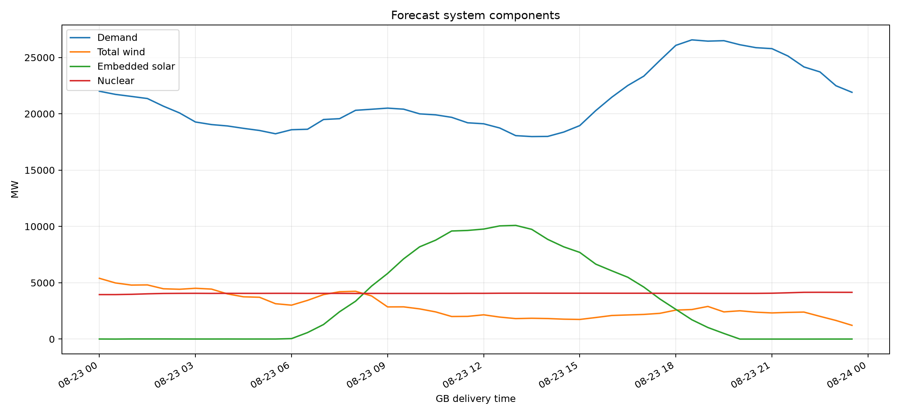
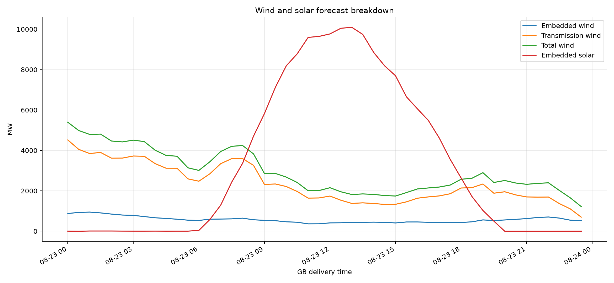
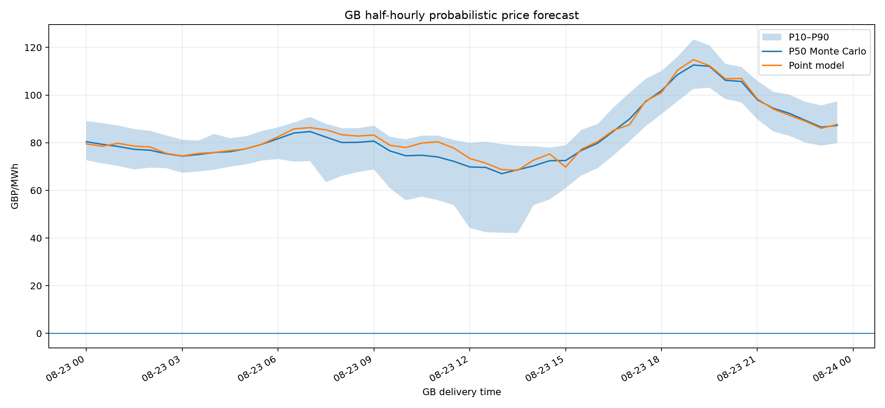
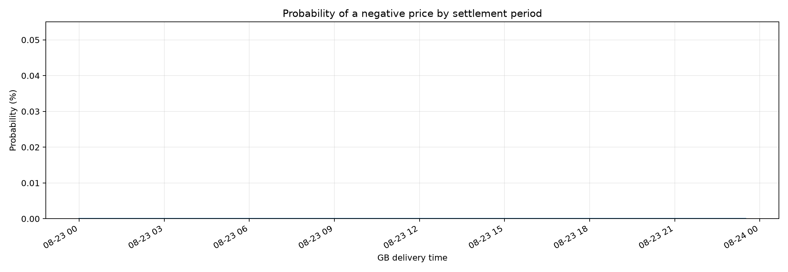

# GB half-hourly market dashboard — 2026-08-23

[Open the complete report](market-report-run-32571859088-attempt-1/report.md)

Every line and marker below represents a 30-minute settlement-period forecast.

## Demand, wind, solar and nuclear

## Half-hourly price probabilities

[Open the complete 30-minute CSV table](market-report-run-32571859088-attempt-1/half_hourly_system_and_price_table.csv)
