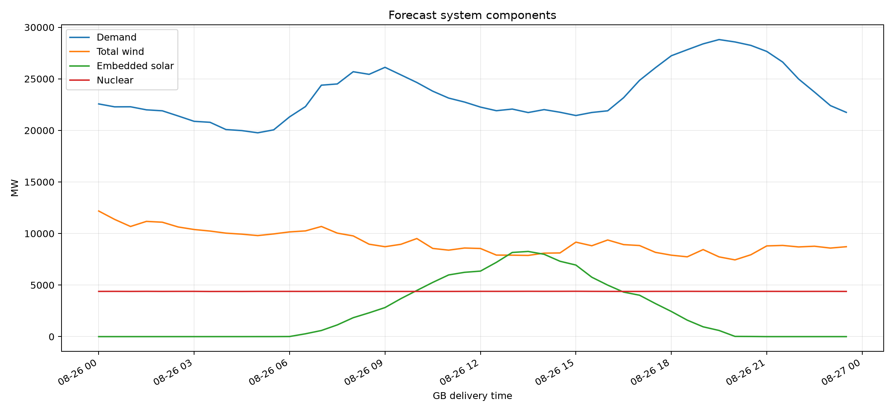
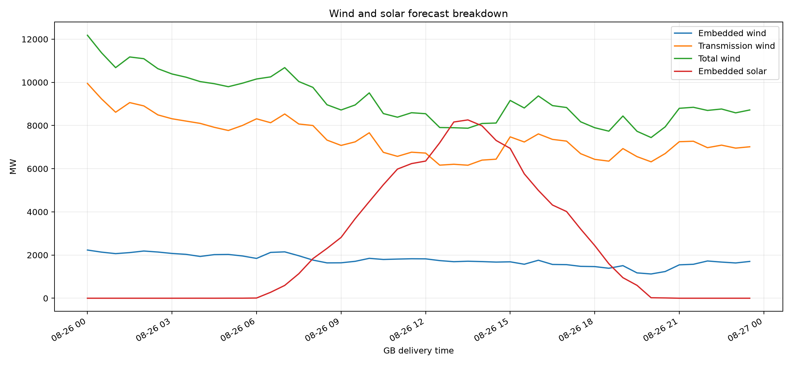
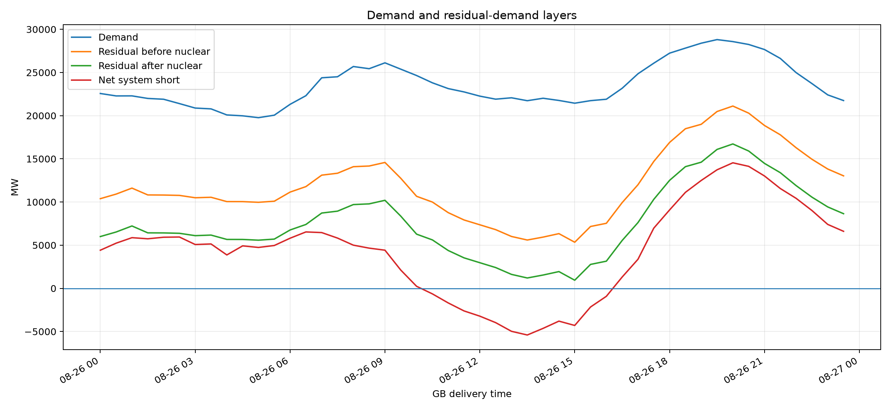
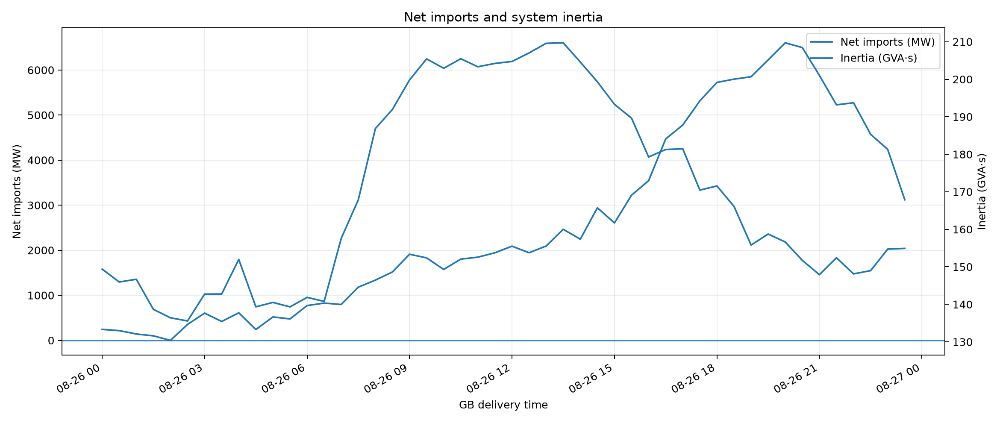
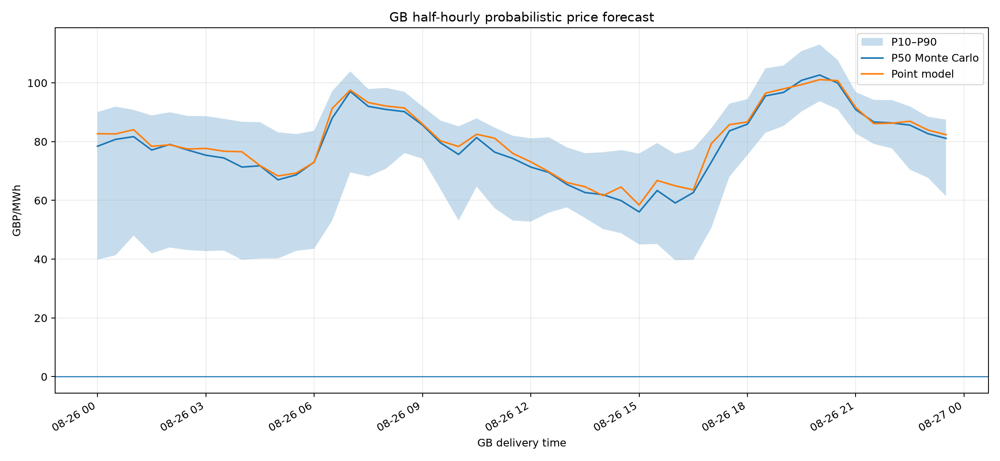
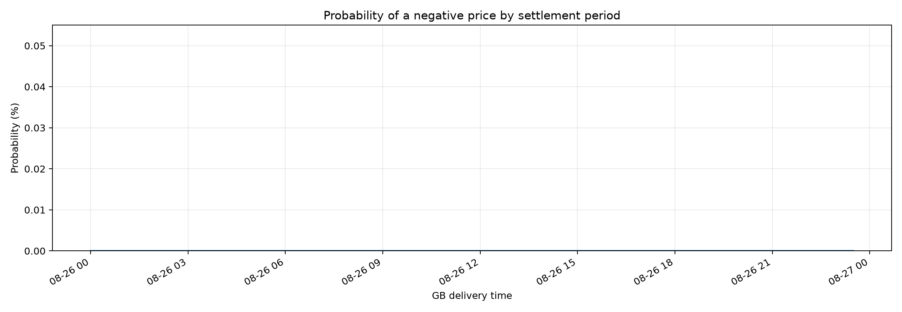
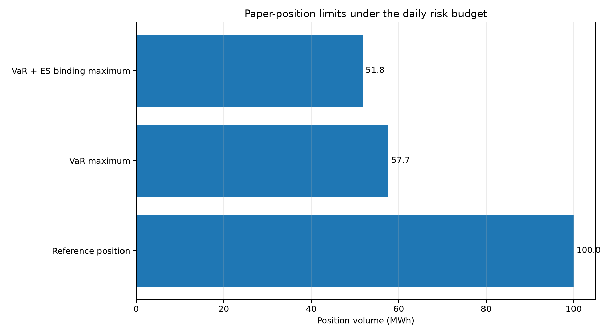

# GB day-ahead market report — 2026-08-26

**Model:** `core-12m-operational-v1`  
**Profile:** `core_without_battery`  
**Issue time:** `2026-08-25T12:17:56.735473+00:00`  
**Monte Carlo scenarios:** `1,000`  
**Settlement periods:** `48`

## Executive summary

- P50 price range: **£56.08–£102.68/MWh**; daily mean **£78.98/MWh**.
- Peak demand: **28,808 MW** at **2026-08-26 19:30 BST**.
- Peak residual demand after nuclear: **16,723 MW** at **2026-08-26 20:00 BST**.
- Scenario VaR for the illustrative 100 MWh position: **£17,342.75**.
- Expected Shortfall: **£19,296.92**.
- Maximum volume under the VaR limit: **57.66 MWh**.
- Conservative binding maximum under both VaR and Expected Shortfall: **51.82 MWh**.

> Position limits are illustrative paper-risk outputs, not autonomous trading authorisation or financial advice.

## Demand, wind, solar and nuclear

### Daily energy summary

| metric | value | unit |
|---|---|---|
| Demand energy | 565,295.0 | MWh |
| Total wind energy | 220,692.0 | MWh |
| Solar energy | 57,376.6 | MWh |
| Nuclear energy | 105,310.5 | MWh |
| Net import energy | 77,269.1 | MWh |

### Component forecast sources

| component | source |
|---|---|
| demand_mw | fallback_d7 |
| embedded_solar_mw | model |
| embedded_wind_mw | model |
| inertia_gvas | model |
| net_import_mw | model |
| nuclear_mw | fallback_d7 |
| transmission_wind_mw | model |

## Residual demand and system balance

Definitions:

- `residual_before_nuclear_mw = demand_mw - total_wind_mw - embedded_solar_mw`
- `residual_after_nuclear_mw = residual_before_nuclear_mw - nuclear_mw`
- `net_system_short_mw = residual_after_nuclear_mw - net_import_mw`

## Probabilistic price forecast

## VaR, Expected Shortfall and maximum permissible volume

The position limit uses the explicitly labelled paper assumptions below. Risk is scaled linearly from the Monte Carlo result for the reference position.

| metric | value | unit |
|---|---|---|
| Paper capital | 500,000.00 | GBP |
| Daily VaR appetite | 2.00 | % capital |
| Daily risk budget | 10,000.00 | GBP |
| Confidence level | 95.00 | % |
| Reference position | 100.00 | MWh |
| Scenario VaR | 17,342.75 | GBP |
| Expected Shortfall | 19,296.92 | GBP |
| Worst simulated loss | 24,079.28 | GBP |
| Best simulated profit | 4,564.86 | GBP |
| VaR budget utilisation | 173.43 | % |
| ES budget utilisation | 192.97 | % |
| Maximum volume by VaR | 57.66 | MWh |
| Maximum volume by Expected Shortfall | 51.82 | MWh |
| Binding maximum permissible volume | 51.82 | MWh |

## Detailed tables

- [Half-hourly system and price table](half_hourly_system_and_price_table.csv)
- [Daily system summary](daily_system_summary.csv)
- [VaR and position limits](var_and_position_limits.csv)
- [Machine-readable report](report.json)
