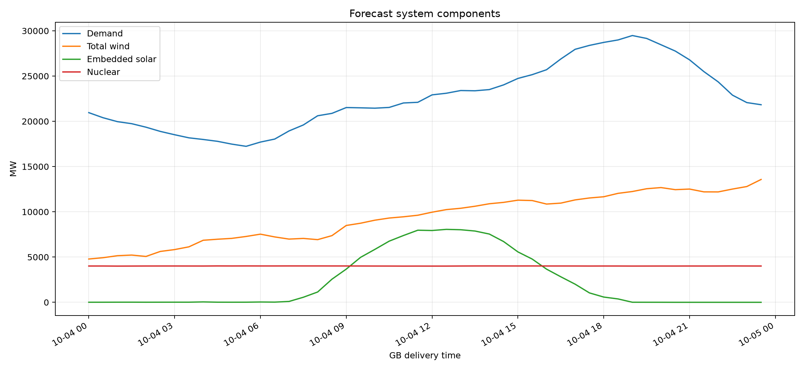
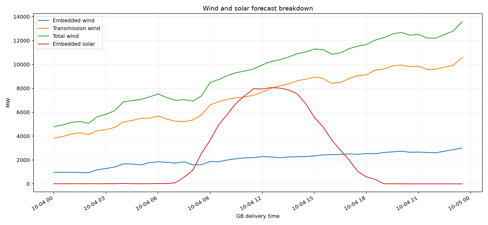
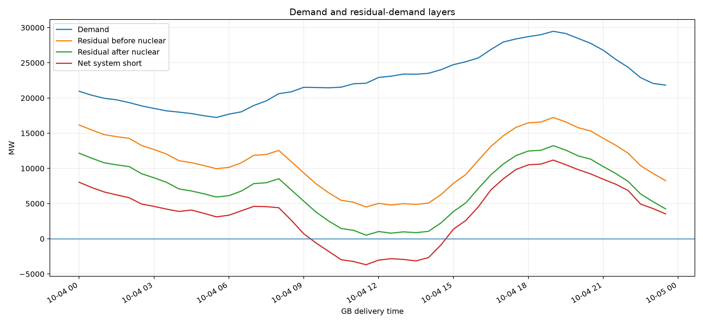
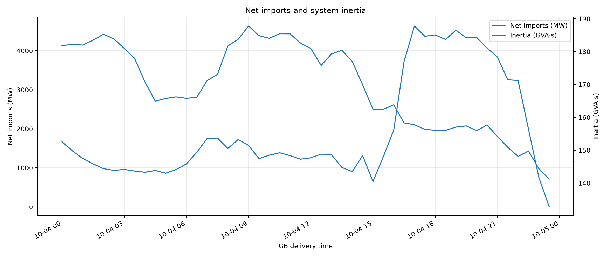
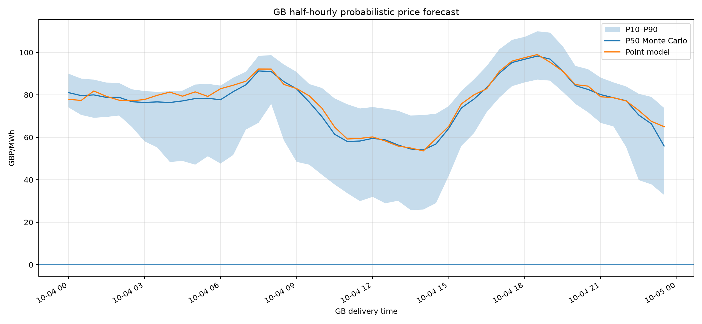
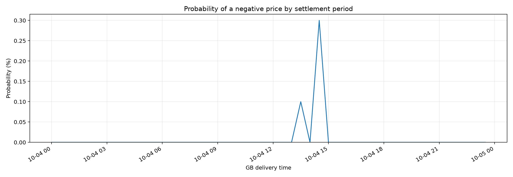
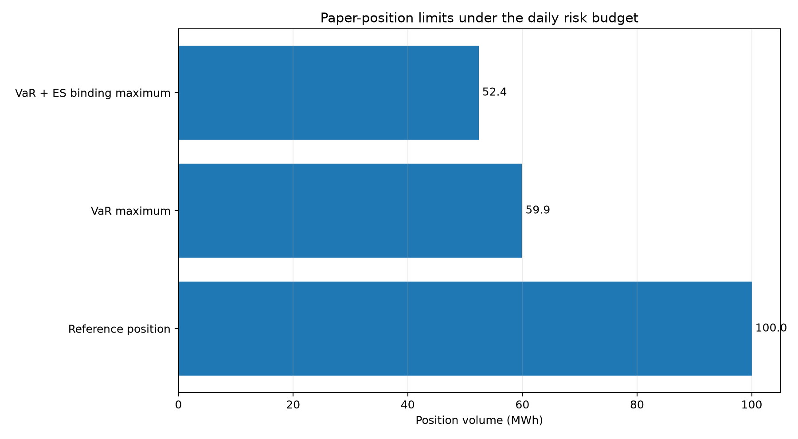

# GB day-ahead market report — 2026-10-04

**Model:** `core-12m-operational-v1`  
**Profile:** `core_without_battery`  
**Issue time:** `2026-10-03T15:15:14.940367+00:00`  
**Monte Carlo scenarios:** `1,000`  
**Settlement periods:** `48`

## Executive summary

- P50 price range: **£54.09–£98.28/MWh**; daily mean **£76.28/MWh**.
- Peak demand: **29,478 MW** at **2026-10-04 19:00 BST**.
- Peak residual demand after nuclear: **13,223 MW** at **2026-10-04 19:00 BST**.
- Scenario VaR for the illustrative 100 MWh position: **£16,689.70**.
- Expected Shortfall: **£19,097.87**.
- Maximum volume under the VaR limit: **59.92 MWh**.
- Conservative binding maximum under both VaR and Expected Shortfall: **52.36 MWh**.

> Position limits are illustrative paper-risk outputs, not autonomous trading authorisation or financial advice.

## Demand, wind, solar and nuclear

### Daily energy summary

| metric | value | unit |
|---|---|---|
| Demand energy | 543,768.5 | MWh |
| Total wind energy | 224,208.1 | MWh |
| Solar energy | 54,071.6 | MWh |
| Nuclear energy | 96,276.5 | MWh |
| Net import energy | 73,981.7 | MWh |

### Component forecast sources

| component | source |
|---|---|
| demand_mw | fallback_d7 |
| embedded_solar_mw | model |
| embedded_wind_mw | model |
| inertia_gvas | model |
| net_import_mw | model |
| nuclear_mw | fallback_d7 |
| transmission_wind_mw | model |

## Residual demand and system balance

Definitions:

- `residual_before_nuclear_mw = demand_mw - total_wind_mw - embedded_solar_mw`
- `residual_after_nuclear_mw = residual_before_nuclear_mw - nuclear_mw`
- `net_system_short_mw = residual_after_nuclear_mw - net_import_mw`

## Probabilistic price forecast

## VaR, Expected Shortfall and maximum permissible volume

The position limit uses the explicitly labelled paper assumptions below. Risk is scaled linearly from the Monte Carlo result for the reference position.

| metric | value | unit |
|---|---|---|
| Paper capital | 500,000.00 | GBP |
| Daily VaR appetite | 2.00 | % capital |
| Daily risk budget | 10,000.00 | GBP |
| Confidence level | 95.00 | % |
| Reference position | 100.00 | MWh |
| Scenario VaR | 16,689.70 | GBP |
| Expected Shortfall | 19,097.87 | GBP |
| Worst simulated loss | 24,461.64 | GBP |
| Best simulated profit | 3,951.54 | GBP |
| VaR budget utilisation | 166.90 | % |
| ES budget utilisation | 190.98 | % |
| Maximum volume by VaR | 59.92 | MWh |
| Maximum volume by Expected Shortfall | 52.36 | MWh |
| Binding maximum permissible volume | 52.36 | MWh |

## Detailed tables

- [Half-hourly system and price table](half_hourly_system_and_price_table.csv)
- [Daily system summary](daily_system_summary.csv)
- [VaR and position limits](var_and_position_limits.csv)
- [Machine-readable report](report.json)
